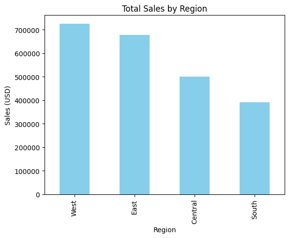

# sales-data-analysis
Analyzing superstore sales data with Python and Tableau
# Sales Data Analysis

## 📊 Overview
This project analyzes sales data from a superstore to identify trends and insights.

## 🛠️ Tools Used
- Python
- Pandas (data analysis)
- Matplotlib (visualization)

## 🔍 Key Insights
1. **Highest Sales**: The West region generated $725,000 in sales.
2. **Lowest Sales**: The South region lagged behind at $400,000.

## 📈 Visualization

## ▶️ How to Run
1. Download the dataset and Jupyter Notebook.
2. Open in Google Colab: 
